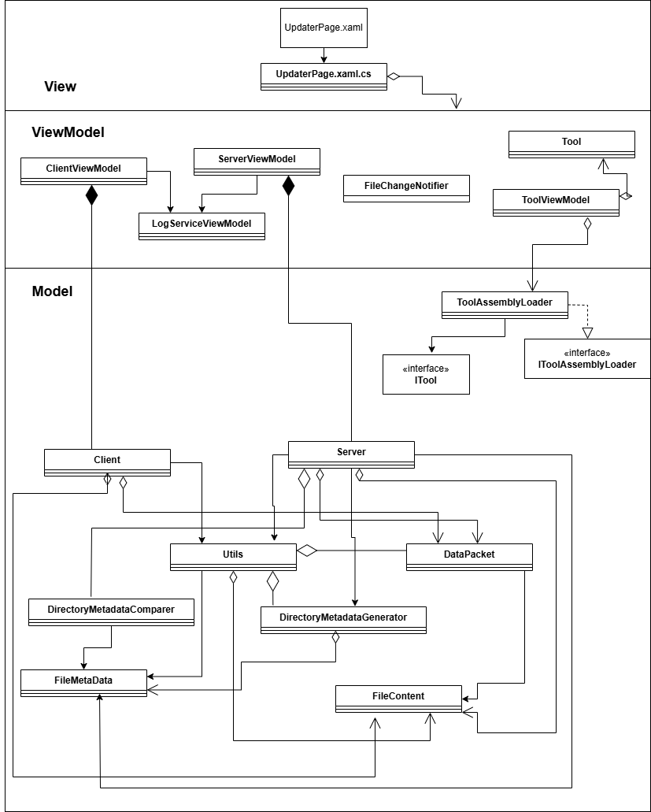

# SoftwareEngineering2024

To run the Updater:

- Run one instance of UI as Server, "Start Server"
- The UI will display the directory being monitored, you can add DLLs in this directory
- In Updater.AppConstants, update the IPAddress and Port to the server IP and Port
- Connect as client to the server ip and port

Features incooperated:

- UI/UX (view) complete development
- The communication between server and multiple client is working
- Client Syncs up with the server on joining, after successful file transfers the server broadcasts new files to all active clients
- Only the latest version of a tool is displayed (To test add the 4 dlls given in the repo into the directory under monitor)
- No repeated tools are displayed, even if duplicates are present in the directory
- The user is notified of any change in the target directory
- Proper logs for file transfer is maintained

Work in progress:

- The buttons on UI
- Cloud Integration

Already integrated:

- Networking team
- UI team

Yet to integrate:

- Dashboard team

